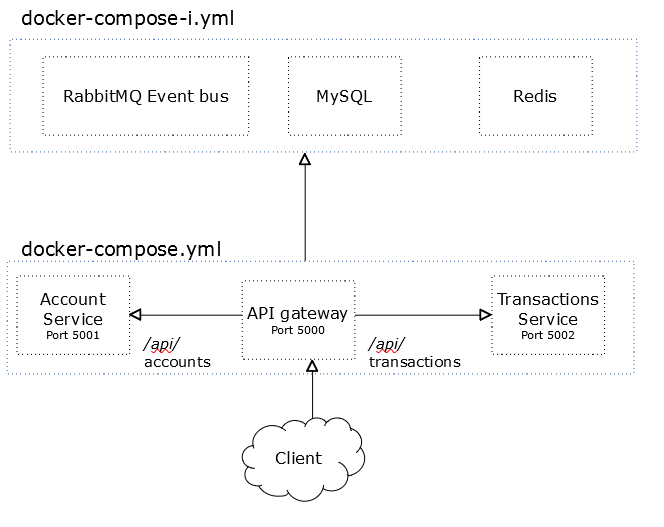
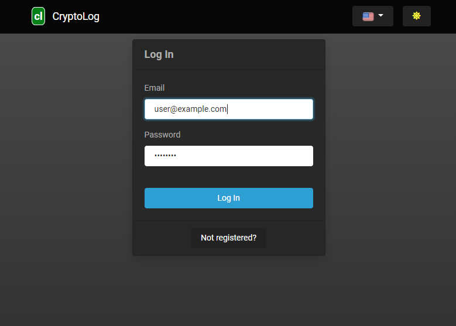
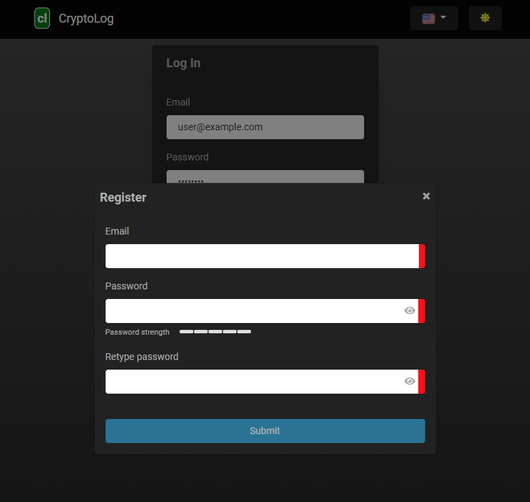
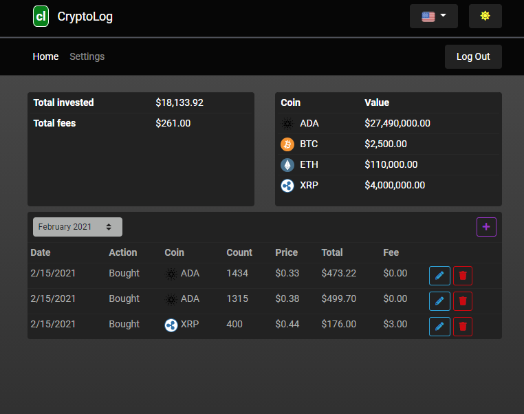
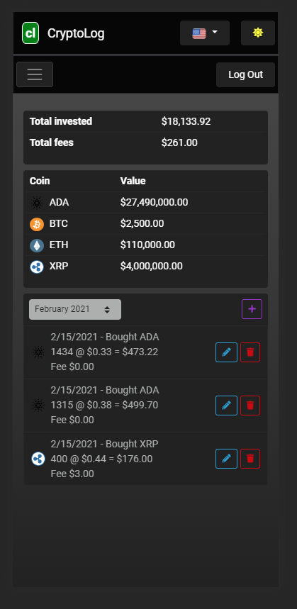

# Description

A functional web application to keep track of your crypto currency transactions. Rather than a full practical application, this is more of an exploration of a microservice architecture components including databases, event buses, and distributed caching.

## Architecture

The architecture diagram above consists of:

- Account service (account management and login capability)
- Transactions service (managing crypto transactions)
- API gateway (Based on Ocelot)
- RabbitMQ (event bus to communicate between the account and transaction services)
- MySQL (DB for each service)
- Redis (for caching latest prices to avoid multiple round trips to external provider)
- Angular client. See bottom for screenshots

There are two docker compose files included. The first, "docker-compose-i.yml", brings up an instance of MySQL, RabbitMQ, and Redis. The second, "docker-compose.yml" brings up the API Gateway, Account service, and Transactions services.

## Nuget packages
- Pomelo MySQL
- StackExchangeRedis
- Polly
- Swashbuckle
- EasyNetQ

#### Todo
- Add oauth login
- Incorporate external API service to obtain current cryptocurrency prices
- Integrate with Kubernetes

#### Angular client screenshots

Login page

Register page

Main page

Main page mobile

